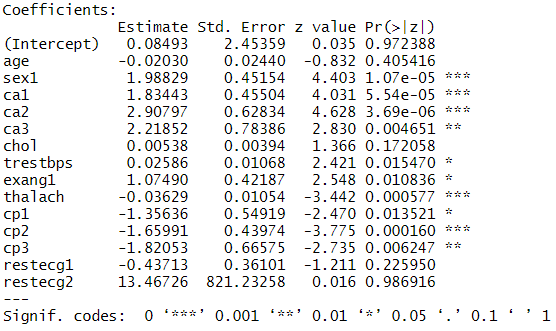

# Heart-Disease-Analysis: Project Goals 
* Determine whether or not a patient's gender increases/decreases their odds of a heart attack 
* Analyze the relationship between chest pain discomfort and odds of a heart attack
* Do older people have greater odds of heart disease
* Do patients with higher cholesteral levels have a higher chance of heart disease
* Are patients with higher levels of chest pain more likelye to suffer from heart disease

## Data Cleaning
Unfortunately, the dataset collected from Kaggle was not as clean as I hoped for. Thus, the following changes below were made to the data: 

  * Removed rows which had the number of major vessels as 4 (3 major vessels was considered the max)
  * Created a new column with the correct target values (i.e. previous target value of 0 was considered as a patient with heart disease; now target value of 1 means  heart disease)
  * Removed patients who were age 34 or younger and 74 or older 
  * Dropped rows where thal levels were 0 
  * Converted factor variables into factor data type (previous data type was int)
  
Data source and variable descriptions can be found [here](https://www.kaggle.com/ronitf/heart-disease-uci)

## Exploratory Data Analysis

The plots below seem to suggest that male patients are more likely to have a heart disease (HD) than female patients. Similarly, the second plot also suggests that male patients are subject to higher levels of chest pain than female patients; howver, this is probably due to the imbalance in the dataset between males and femaale patients. Moreover, if we take a look at the chest pain levels and its relationship with HD presence, we see something quite interesting. Conventional wisdom suggests that if a patient is suffering from higher levels of chest pain, then perhaps they might be more likely to have a HD. However, this is may not be the case; the 3rd plot shows that there are more patients with HD at lower levels of chest pain.

 Additionally, taking a look at the following plot below, it would appear that heart disease might be more common amongst older patients.

## Modeling and Results 

For this dataset, I decided to run a simple logistic model. The response variable will be the `target` variable and the covariates used are `age`, `sex`, `number of major vessels`, `restecg`, `restbps`, `exercise induced angina`, `thal`, `chest pain`, `cholesteral`

Below shows a summary of the model:

## Conclusion

